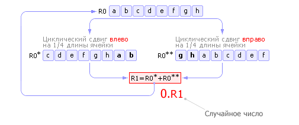

Метод перемешивания — это один из простейших методов генерации
последовательностей случайных чисел, где каждое следующее равно
сумме двух чисел, первое из которых получено циклическим сдвигом
вправо данного числа на четверть длины, а второе — тем же
циклическим сдвигом, но влево.



Алгоритм можно записать на псевдокоде следующим образом:

```Python
# <<< — циклический сдвиг влево
# >>> — циклический сдвиг вправо

numlen = 64
cur    = ...

def rnd():
	a = cur <<< (numlen // 4)
	b = cur >>> (numlen // 4)
	cur = (a + b) % (2 ** 64)
	return cur
```
